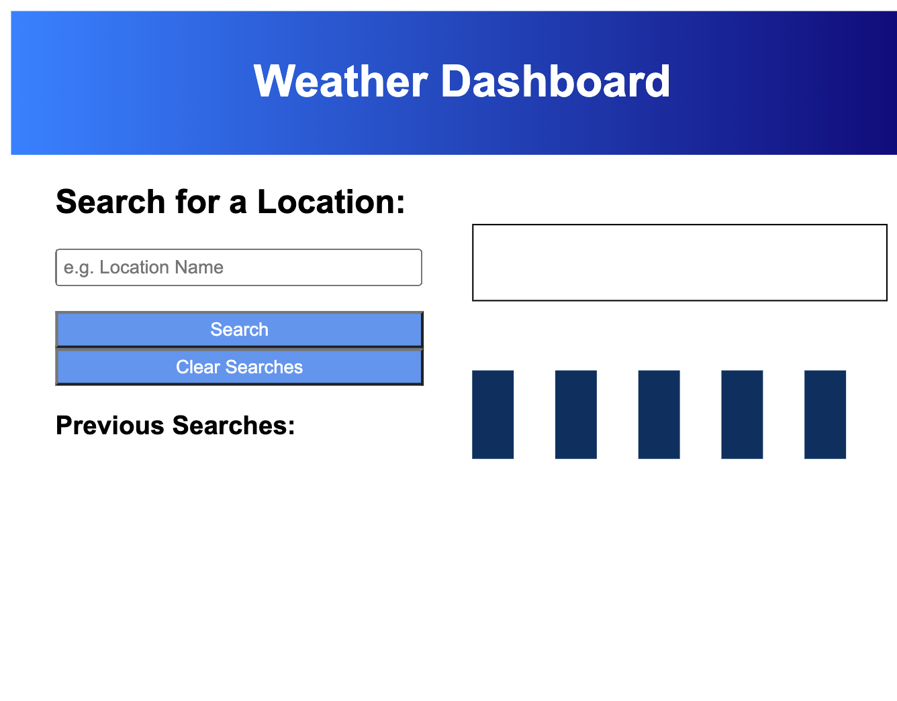

# Weather Dashboard

# Description
The Weather Dashboard fetches data from OpenWeather API and displays a 5 day weather forecast for the searched city.

# Usage
To use this application the user can click the deployment link below. The user can then search for a specific city and can click search to see the upcoming 5 day weather forecast. User can see the Temperature, Wind, & Humidity.

### Deployment Link
(https://rmontgomery4801.github.io/weather-dashboard/)

